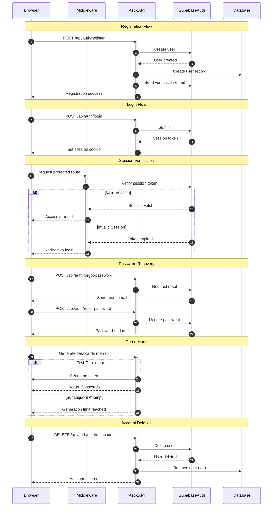

```mermaid
sequenceDiagram
    autonumber
    participant Browser
    participant Middleware
    participant AstroAPI
    participant SupabaseAuth
    participant Database

    Note over Browser,Database: Registration Flow
    Browser->>AstroAPI: POST /api/auth/register
    activate AstroAPI
    AstroAPI->>SupabaseAuth: Create user
    SupabaseAuth-->>AstroAPI: User created
    AstroAPI->>Database: Create user record
    AstroAPI->>SupabaseAuth: Send verification email
    AstroAPI-->>Browser: Registration success
    deactivate AstroAPI

    Note over Browser,Database: Login Flow
    Browser->>AstroAPI: POST /api/auth/login
    activate AstroAPI
    AstroAPI->>SupabaseAuth: Sign in
    SupabaseAuth-->>AstroAPI: Session token
    AstroAPI-->>Browser: Set session cookie
    deactivate AstroAPI

    Note over Browser,Database: Session Verification
    Browser->>Middleware: Request protected route
    activate Middleware
    Middleware->>SupabaseAuth: Verify session token
    alt Valid Session
        SupabaseAuth-->>Middleware: Session valid
        Middleware-->>Browser: Access granted
    else Invalid Session
        SupabaseAuth-->>Middleware: Token expired
        Middleware-->>Browser: Redirect to login
    end
    deactivate Middleware

    Note over Browser,Database: Password Recovery
    Browser->>AstroAPI: POST /api/auth/forgot-password
    activate AstroAPI
    AstroAPI->>SupabaseAuth: Request reset
    SupabaseAuth->>Browser: Send reset email
    Browser->>AstroAPI: POST /api/auth/reset-password
    AstroAPI->>SupabaseAuth: Update password
    SupabaseAuth-->>Browser: Password updated
    deactivate AstroAPI

    Note over Browser,Database: Demo Mode
    Browser->>AstroAPI: Generate flashcards (demo)
    activate AstroAPI
    alt First Generation
        AstroAPI->>Browser: Set demo token
        AstroAPI-->>Browser: Return flashcards
    else Subsequent Attempt
        AstroAPI-->>Browser: Generation limit reached
    end
    deactivate AstroAPI

    Note over Browser,Database: Account Deletion
    Browser->>AstroAPI: DELETE /api/auth/delete-account
    activate AstroAPI
    AstroAPI->>SupabaseAuth: Delete user
    SupabaseAuth-->>AstroAPI: User deleted
    AstroAPI->>Database: Remove user data
    AstroAPI-->>Browser: Account deleted
    deactivate AstroAPI
```