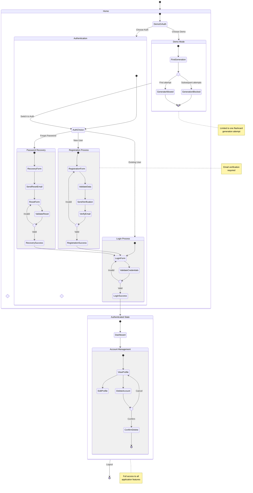

```mermaid
stateDiagram-v2
    [*] --> Home
    
    state "Home" as Home {
        [*] --> DemoOrAuth
        state "DemoOrAuth" as DemoOrAuth <<choice>>
        DemoOrAuth --> Demo : Choose Demo
        DemoOrAuth --> Auth : Choose Auth
    }
    
    state "Demo Mode" as Demo {
        [*] --> FirstGeneration
        state check_generation <<choice>>
        FirstGeneration --> check_generation
        check_generation --> GenerateAllowed : First attempt
        check_generation --> GenerationBlocked : Subsequent attempts
        GenerateAllowed --> [*]
        GenerationBlocked --> [*]
    }
    
    state "Authentication" as Auth {
        [*] --> AuthChoice
        state "AuthChoice" as AuthChoice <<choice>>
        AuthChoice --> Login : Existing User
        AuthChoice --> Register : New User
        AuthChoice --> ForgotPassword : Forgot Password
        
        state "Registration Process" as Register {
            [*] --> RegistrationForm
            RegistrationForm --> ValidateData
            ValidateData --> SendVerification
            SendVerification --> VerifyEmail
            
            state if_verify <<choice>>
            VerifyEmail --> if_verify
            if_verify --> RegistrationSuccess : Valid
            if_verify --> RegistrationForm : Invalid
        }
        
        state "Login Process" as Login {
            [*] --> LoginForm
            LoginForm --> ValidateCredentials
            
            state if_valid <<choice>>
            ValidateCredentials --> if_valid
            if_valid --> LoginSuccess : Valid
            if_valid --> LoginForm : Invalid
        }
        
        state "Password Recovery" as ForgotPassword {
            [*] --> RecoveryForm
            RecoveryForm --> SendResetEmail
            SendResetEmail --> ResetForm
            ResetForm --> ValidateReset
            
            state if_reset <<choice>>
            ValidateReset --> if_reset
            if_reset --> RecoverySuccess : Valid
            if_reset --> ResetForm : Invalid
        }
    }
    
    state "Authenticated State" as AuthenticatedState {
        [*] --> Dashboard
        Dashboard --> AccountSettings
        
        state "Account Management" as AccountSettings {
            [*] --> ViewProfile
            ViewProfile --> EditProfile
            ViewProfile --> DeleteAccount
            
            state if_delete <<choice>>
            DeleteAccount --> if_delete
            if_delete --> ConfirmDelete : Confirm
            if_delete --> ViewProfile : Cancel
            ConfirmDelete --> [*]
        }
    }
    
    RegistrationSuccess --> LoginForm
    LoginSuccess --> AuthenticatedState
    RecoverySuccess --> LoginForm
    Demo --> AuthChoice : Switch to Auth
    AuthenticatedState --> [*] : Logout
    
    note right of Demo
        Limited to one flashcard
        generation attempt
    end note
    
    note right of Register
        Email verification
        required
    end note
    
    note right of AuthenticatedState
        Full access to all
        application features
    end note
```