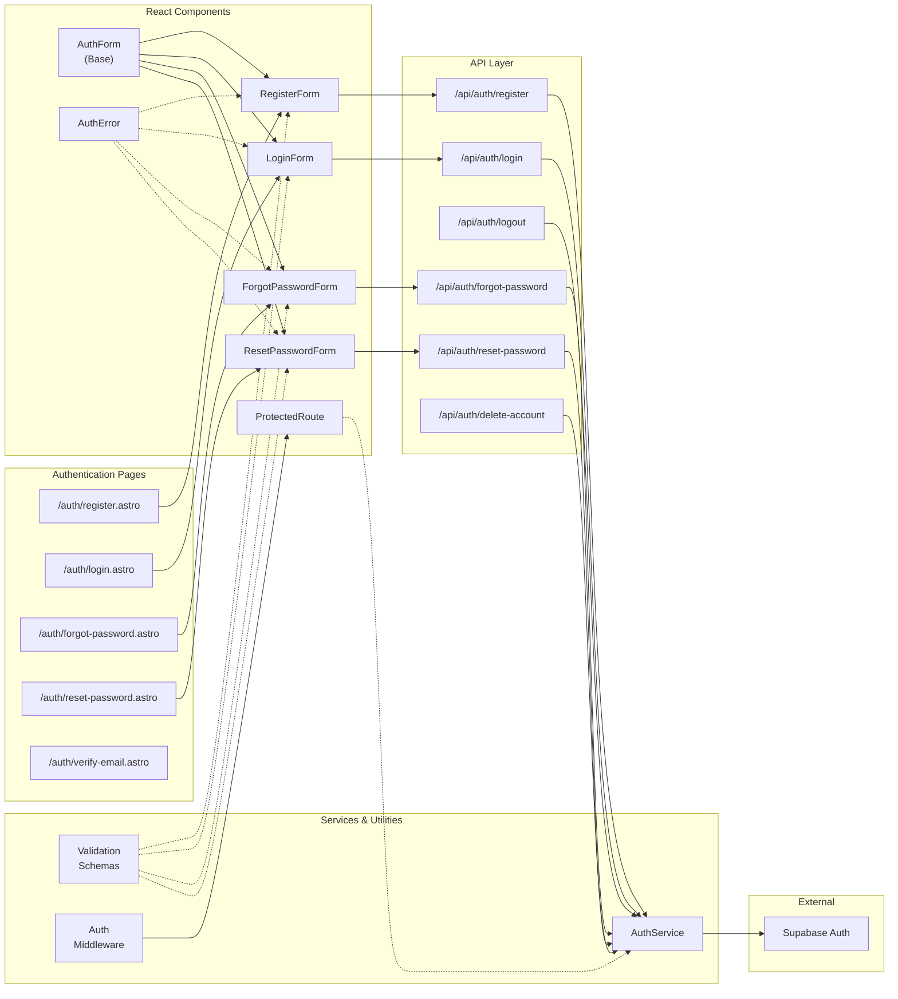

```mermaid
flowchart LR
    subgraph "Authentication Pages"
        direction TB
        Register["/auth/register.astro"]
        Login["/auth/login.astro"]
        ForgotPw["/auth/forgot-password.astro"]
        ResetPw["/auth/reset-password.astro"]
        VerifyEmail["/auth/verify-email.astro"]
    end

    subgraph "React Components"
        direction TB
        AuthForm["AuthForm<br/>(Base)"]
        RegForm["RegisterForm"]
        LoginForm["LoginForm"]
        ForgotForm["ForgotPasswordForm"]
        ResetForm["ResetPasswordForm"]
        AuthError["AuthError"]
        Protected["ProtectedRoute"]
    end

    subgraph "API Layer"
        direction TB
        RegAPI["/api/auth/register"]
        LoginAPI["/api/auth/login"]
        LogoutAPI["/api/auth/logout"]
        ForgotAPI["/api/auth/forgot-password"]
        ResetAPI["/api/auth/reset-password"]
        DeleteAPI["/api/auth/delete-account"]
    end

    subgraph "Services & Utilities"
        direction TB
        AuthService["AuthService"]
        Validation["Validation<br/>Schemas"]
        Middleware["Auth<br/>Middleware"]
    end

    subgraph "External"
        Supabase["Supabase Auth"]
    end

    %% Component Relationships
    AuthForm --> RegForm & LoginForm & ForgotForm & ResetForm

    %% Page to Component Flow
    Register --> RegForm
    Login --> LoginForm
    ForgotPw --> ForgotForm
    ResetPw --> ResetForm

    %% Error Handling
    AuthError -.-> RegForm & LoginForm & ForgotForm & ResetForm

    %% Form to API Flow
    RegForm --> RegAPI
    LoginForm --> LoginAPI
    ForgotForm --> ForgotAPI
    ResetForm --> ResetAPI

    %% API to Service Flow
    RegAPI & LoginAPI & LogoutAPI & ForgotAPI & ResetAPI & DeleteAPI --> AuthService

    %% Validation Flow
    Validation -.-> RegForm & LoginForm & ForgotForm & ResetForm

    %% Middleware Interactions
    Middleware --> Protected
    Protected -.-> AuthService

    %% External Service Integration
    AuthService --> Supabase
```